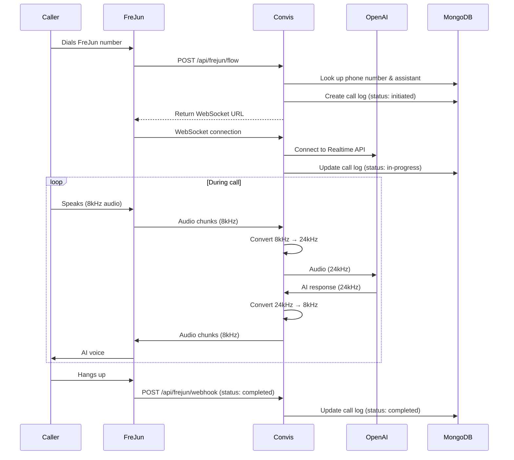
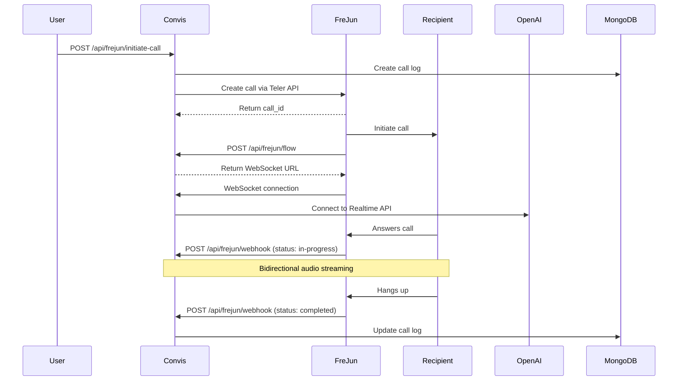

# FreJun (Teler) Integration Guide

## Overview

FreJun integration enables your Convis AI platform to handle incoming and outgoing voice calls through the FreJun (Teler) telephony platform. This integration provides:

- **Incoming Call Handling**: Receive calls on FreJun numbers and route them to AI assistants
- **Outbound Call Initiation**: Make calls using FreJun numbers
- **Real-time Audio Streaming**: Bidirectional WebSocket audio streaming with OpenAI Realtime API
- **Call Recording & Transcription**: Automatic recording and logging of all calls
- **Call Status Tracking**: Real-time updates on call status

## Architecture

```
┌─────────────┐         ┌──────────────┐         ┌──────────────┐
│   FreJun    │◄───────►│ Convis API   │◄───────►│   OpenAI     │
│  Platform   │  HTTP   │  (FastAPI)   │WebSocket│ Realtime API │
└─────────────┘         └──────────────┘         └──────────────┘
      │                         │
      │                         │
   Webhooks              Audio Conversion
   & Call Flow          (8kHz ↔ 24kHz)
```

## Prerequisites

1. **FreJun Account**: Sign up at [FreJun Platform](https://platform.frejun.ai)
2. **FreJun API Key**: Obtain from FreJun dashboard
3. **OpenAI API Key**: Required for AI voice interactions
4. **MongoDB**: For call logs and configuration storage
5. **Public HTTPS URL**: For webhooks (use ngrok for development)

## Installation

### 1. Install Dependencies

The `teler` package is already added to `requirements.txt`:

```bash
cd convis-api
pip install -r requirements.txt
```

### 2. Configure Environment Variables

Add the following to your `.env` file:

```bash
# FreJun Configuration
FREJUN_API_KEY=your_frejun_api_key_here

# Your public base URL (for webhooks)
API_BASE_URL=https://api.convis.ai
# or for development with ngrok:
# API_BASE_URL=https://your-ngrok-id.ngrok.io
```

### 3. Verify Integration

Check that the FreJun router is loaded in `main.py`:

```python
from app.routes.frejun import router as frejun_router

app.include_router(frejun_router, prefix="/api/frejun", tags=["FreJun Calls"])
```

## FreJun Platform Configuration

### Setting Up Your App in FreJun

1. **Log in to FreJun Platform**: https://platform.frejun.ai
2. **Create a New App** with these settings:

   | Field | Value |
   |-------|-------|
   | **App name** | `Convis` |
   | **Incoming call URL** | `https://api.convis.ai/api/frejun/flow` |
   | **Call status URL** | `https://api.convis.ai/api/frejun/webhook` |

3. **Copy your API Key** from the FreJun dashboard

### Assign Phone Numbers

1. Purchase or provision a phone number in FreJun
2. Assign the number to your Convis app
3. Add the number to your Convis database:

```javascript
// In MongoDB, add to phone_numbers collection
{
  "phone_number": "+1234567890",
  "provider": "frejun",
  "assigned_assistant_id": ObjectId("your_assistant_id"),
  "user_id": ObjectId("your_user_id"),
  "created_at": ISODate(),
  "status": "active"
}
```

## API Endpoints

### 1. Call Flow Configuration
**Endpoint**: `POST /api/frejun/flow`

FreJun calls this endpoint when an incoming call is received.

**Request Body**:
```json
{
  "call_id": "call_abc123",
  "account_id": "acc_xyz789",
  "from_number": "+1234567890",
  "to_number": "+0987654321"
}
```

**Response**:
```json
{
  "type": "stream",
  "ws_url": "wss://api.convis.ai/api/frejun/media-stream/assistant_id?call_id=call_abc123",
  "chunk_size": 500,
  "record": true
}
```

### 2. Call Status Webhook
**Endpoint**: `POST /api/frejun/webhook`

Receives call status updates from FreJun.

**Request Body**:
```json
{
  "call_id": "call_abc123",
  "status": "completed",
  "duration": 120,
  "from_number": "+1234567890",
  "to_number": "+0987654321"
}
```

**Status Values**:
- `initiated` - Call is being initiated
- `ringing` - Phone is ringing
- `in-progress` - Call is active
- `completed` - Call ended normally
- `busy` - Recipient was busy
- `failed` - Call failed
- `no-answer` - No one answered

### 3. Media Stream WebSocket
**Endpoint**: `WebSocket /api/frejun/media-stream/{assistant_id}`

Bidirectional audio streaming between FreJun and OpenAI.

**Audio Format**:
- **FreJun → Convis**: 8kHz, 16-bit PCM, mono, base64-encoded
- **Convis → OpenAI**: 24kHz, 16-bit PCM, mono (auto-converted)
- **OpenAI → Convis**: 24kHz, 16-bit PCM, mono
- **Convis → FreJun**: 8kHz, 16-bit PCM, mono (auto-converted)

**FreJun → Convis Messages**:
```json
// Audio chunk
{
  "type": "audio",
  "audio_b64": "base64_encoded_audio_data"
}

// Stream started
{
  "type": "start"
}

// Stream stopped
{
  "type": "stop"
}
```

**Convis → FreJun Messages**:
```json
// Audio chunk
{
  "type": "audio",
  "audio_b64": "base64_encoded_audio_data",
  "chunk_id": 123
}

// Clear audio buffer (interruption)
{
  "type": "clear"
}
```

### 4. Initiate Outbound Call
**Endpoint**: `POST /api/frejun/initiate-call`

Create an outbound call using FreJun.

**Request Body**:
```json
{
  "from_number": "+1234567890",
  "to_number": "+0987654321",
  "assistant_id": "507f1f77bcf86cd799439011",
  "user_id": "507f191e810c19729de860ea"
}
```

**Response**:
```json
{
  "success": true,
  "call_id": "call_abc123",
  "message": "Call initiated successfully"
}
```

### 5. Health Check
**Endpoint**: `GET /api/frejun/health`

Check FreJun integration status.

**Response**:
```json
{
  "status": "healthy",
  "service": "frejun-integration",
  "version": "1.0.0"
}
```

## Call Flow

### Incoming Call Flow



### Outbound Call Flow



## Audio Format Conversion

The integration automatically handles audio format conversion:

### Incoming Audio (FreJun → OpenAI)
```python
# FreJun sends: 8kHz, 16-bit, mono
# OpenAI expects: 24kHz, 16-bit, mono

# Upsample 8kHz to 24kHz (3x)
resampled_audio = audioop.ratecv(
    audio_bytes,
    2,        # 16-bit samples = 2 bytes
    1,        # mono
    8000,     # from 8kHz
    24000,    # to 24kHz
    None
)[0]
```

### Outgoing Audio (OpenAI → FreJun)
```python
# OpenAI sends: 24kHz, 16-bit, mono
# FreJun expects: 8kHz, 16-bit, mono

# Downsample 24kHz to 8kHz
resampled_audio = audioop.ratecv(
    audio_bytes,
    2,        # 16-bit samples
    1,        # mono
    24000,    # from 24kHz
    8000,     # to 8kHz
    None
)[0]
```

## Database Schema

### Call Logs Collection

```javascript
{
  "_id": ObjectId("..."),
  "call_sid": "call_abc123",           // Call identifier (compatible with Twilio)
  "frejun_call_id": "call_abc123",     // FreJun-specific call ID
  "assistant_id": "assistant_xyz",     // AI assistant used
  "user_id": ObjectId("..."),          // User who owns the assistant
  "from_number": "+1234567890",        // Caller number
  "to_number": "+0987654321",          // Recipient number
  "call_type": "inbound",              // "inbound" or "outbound"
  "call_status": "completed",          // Call status
  "platform": "frejun",                // Platform identifier
  "duration": 120,                     // Call duration in seconds
  "started_at": ISODate("..."),        // When call started
  "ended_at": ISODate("..."),          // When call ended
  "created_at": ISODate("..."),        // Record creation time
  "updated_at": ISODate("...")         // Last update time
}
```

### Phone Numbers Collection

```javascript
{
  "_id": ObjectId("..."),
  "phone_number": "+1234567890",
  "provider": "frejun",
  "assigned_assistant_id": ObjectId("..."),
  "user_id": ObjectId("..."),
  "status": "active",
  "created_at": ISODate("..."),
  "capabilities": {
    "voice": true,
    "sms": false
  }
}
```

## Testing

### 1. Test Health Endpoint

```bash
curl https://api.convis.ai/api/frejun/health
```

Expected response:
```json
{
  "status": "healthy",
  "service": "frejun-integration",
  "version": "1.0.0"
}
```

### 2. Test Incoming Call Flow

1. Configure a FreJun number in your database
2. Assign an AI assistant to the number
3. Call the FreJun number from your phone
4. Verify the AI answers and can have a conversation

### 3. Test Outbound Call

```bash
curl -X POST https://api.convis.ai/api/frejun/initiate-call \
  -H "Content-Type: application/json" \
  -d '{
    "from_number": "+1234567890",
    "to_number": "+0987654321",
    "assistant_id": "your_assistant_id",
    "user_id": "your_user_id"
  }'
```

### 4. Monitor Logs

```bash
# Watch API logs
tail -f /var/log/convis-api/app.log | grep FREJUN

# Or with Docker
docker-compose logs -f api | grep FREJUN
```

## Troubleshooting

### Issue: "Phone number not configured"

**Cause**: The called number is not in your database.

**Solution**: Add the phone number to MongoDB:
```javascript
db.phone_numbers.insertOne({
  "phone_number": "+1234567890",
  "provider": "frejun",
  "assigned_assistant_id": ObjectId("your_assistant_id"),
  "user_id": ObjectId("your_user_id"),
  "status": "active",
  "created_at": new Date()
})
```

### Issue: "OpenAI API key not configured"

**Cause**: User doesn't have an OpenAI API key set.

**Solution**: Add OpenAI key to user document:
```javascript
db.users.updateOne(
  { "_id": ObjectId("user_id") },
  { "$set": { "openai_key": "sk-..." } }
)
```

### Issue: "FreJun API key not configured"

**Cause**: `FREJUN_API_KEY` not set in environment variables.

**Solution**: Add to `.env` file:
```bash
FREJUN_API_KEY=your_api_key_here
```

### Issue: Audio quality is poor

**Cause**: Sample rate conversion issues.

**Solution**:
- Ensure `audioop` module is installed
- Check logs for conversion errors
- Verify audio chunk sizes are correct (500 bytes)

### Issue: WebSocket disconnects immediately

**Cause**: OpenAI API key invalid or quota exceeded.

**Solution**:
- Verify OpenAI API key is valid
- Check OpenAI account has credits
- Monitor logs for OpenAI error messages

### Issue: Calls not reaching webhook

**Cause**: Webhook URL not accessible from internet.

**Solution**:
- Use ngrok for development: `ngrok http 8000`
- Update `API_BASE_URL` in `.env` to ngrok URL
- Verify firewall allows incoming HTTPS traffic
- Check FreJun app configuration has correct webhook URL

## Development with ngrok

For local development, use ngrok to expose your API:

```bash
# Start ngrok
ngrok http 8000

# Copy the ngrok URL (e.g., https://abc123.ngrok.io)
# Update .env
API_BASE_URL=https://abc123.ngrok.io

# Update FreJun app configuration
# Incoming call URL: https://abc123.ngrok.io/api/frejun/flow
# Call status URL: https://abc123.ngrok.io/api/frejun/webhook

# Restart API server
docker-compose restart api
```

## Production Deployment

### 1. Set Environment Variables

```bash
FREJUN_API_KEY=prod_api_key_here
API_BASE_URL=https://api.convis.ai
ENVIRONMENT=production
```

### 2. Update FreJun Configuration

- **Incoming call URL**: `https://api.convis.ai/api/frejun/flow`
- **Call status URL**: `https://api.convis.ai/api/frejun/webhook`

### 3. SSL/TLS Requirements

- FreJun requires HTTPS for webhooks
- WebSocket connections must use WSS (secure WebSocket)
- Ensure valid SSL certificate on your domain

### 4. Scaling Considerations

- WebSocket connections are stateful - use sticky sessions with load balancers
- Each call maintains 2 WebSocket connections (FreJun + OpenAI)
- Monitor connection limits and scale horizontally as needed

## Monitoring & Logging

All FreJun operations are logged with `[FREJUN]` prefix:

```
2025-10-31 13:45:23 - INFO - [FREJUN] Call flow requested - Call ID: call_abc123
2025-10-31 13:45:24 - INFO - [FREJUN WS] WebSocket connected for assistant xyz
2025-10-31 13:45:24 - INFO - [FREJUN WS] Connected to OpenAI Realtime API
2025-10-31 13:45:30 - INFO - [FREJUN WS] User said: Hello, I need help
2025-10-31 13:45:32 - INFO - [FREJUN WS] AI said: Hello! How can I assist you?
2025-10-31 13:46:15 - INFO - [FREJUN WEBHOOK] Updated call call_abc123 with status completed
```

## Security Best Practices

1. **API Key Protection**: Store FreJun API key in environment variables, never in code
2. **Webhook Validation**: Consider adding signature verification for webhooks
3. **Rate Limiting**: Implement rate limiting on public endpoints
4. **HTTPS Only**: Never expose endpoints over HTTP in production
5. **Database Security**: Use MongoDB authentication and network restrictions

## Support

- **FreJun Documentation**: https://docs.frejun.ai
- **FreJun Support**: support@frejun.ai
- **Convis Issues**: https://github.com/your-org/convis/issues

## License

This integration is part of the Convis platform and follows the same license.
